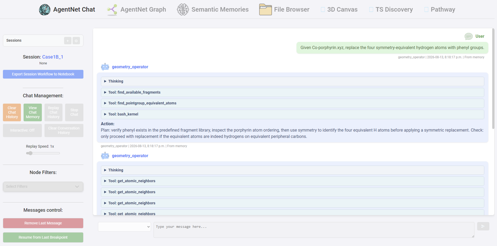
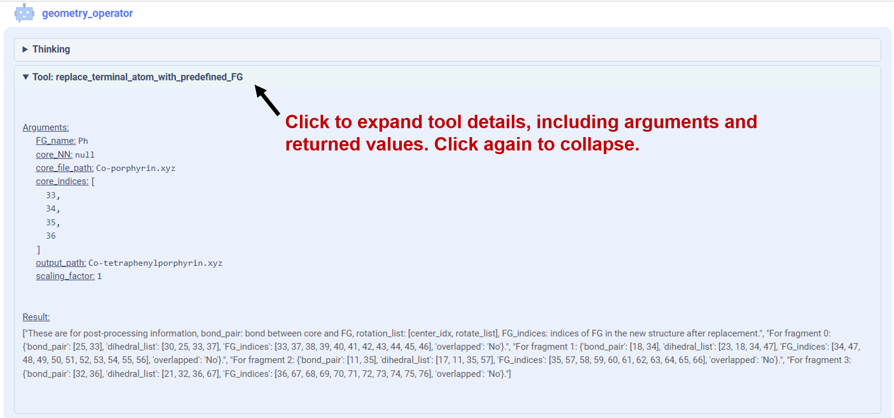

# Benchmark Data and Agent Traces

This repository contains the input files, output geometries, and agent traces associated with the case-study benchmarks and additional evaluation tests reported in the revised manuscript and Supporting Information.

## Directory Structure

Unless otherwise noted, each project directory contains five independent runs:

```text
Directory/
├── run1/
├── run2/
├── run3/
├── run4/
└── run5/
```

Each `run` directory contains the files associated with that independent run, including the corresponding input file(s), output geometry file(s), and agent trace (`.mhtml`).

`Case_study7_chem_reasoning_TS/` uses a different directory structure. Please refer to the separate `README.md` within that directory for details.

## Case-Study Benchmarks

| Directory | Corresponding Figure |
| --- | --- |
| `Case_study1A_spermidine_protection/` | Figure 2a |
| `Case_study1A_spermidine_protection_generic/` | Figure S14a |
| `Case_study1B_Co-porphyrin_phenyl/` | Figure 2b |
| `Case_study1B_Co-porphyrin_phenyl_generic/` | Figure S14b |
| `Case_study2_Co-Pc_ligand_binding/` | Figure 3 |
| `Case_study2_Co-Pc_ligand_binding_generic/` | Figure S18 |
| `Case_study3A_isomers/` | Figure 4a |
| `Case_study3B_zirconocene/` | Figure 4b |
| `Case_study3C_CpRusumanene/` | Figure 5 |
| `Case_study4A_MoCl3PNP/` | Figure 6a |
| `Case_study4B_ligand_exchange/` | Figure 6b |
| `Case_study5A_isomers_and_enantiomers/` | Figure 7a |
| `Case_study5B_fragment_identification/` | Figure 7b |
| `Case_study6_ethylene_insertion/` | Figure 8 |
| `Case_study7_chem_reasoning_TS/` | Figure 9 |

## Robustness Tests

The following project directories are located under `robustness_test/`.

| Directory | Corresponding Figure |
| --- | --- |
| `Case_study1B_Co-porphyrin_phenyl/` | Figure S15a |
| `Case_study1B_Co-porphyrin_phenyl_generic/` | Figure S15b |
| `Case_study1B_porphyrin_generic/` | Figure S16 |

## Configuration Tests

The following project directories are located under `configuration_test/`.

| Directory | Corresponding Figure |
| --- | --- |
| `Case_study2_Pb-Pc_ligand_binding/` | Figure S20 |
| `Case_study3C_CpRusumanene/` | Figure S19 |

## Tool-Ablation Tests

The following project directories are located under `tool_ablation/`.

| Directory | Corresponding Figure |
| --- | --- |
| `Case_study1B_Co-porphyrin_phenyl/` | Figure S21a |
| `Case_study1B_Co-porphyrin_phenyl_generic/` | Figure S21b |
| `Case_study2_Co-Pc_ligand_binding/` | Figure S22 |
| `Case_study6_ethylene_insertion/` | Figure S23 |
| `Case_study6_ethylene_insertion_TS_only/` (a) | Figure S24 |
| `Case_study6_ethylene_insertion_TS_only_wotools/` (b) | Figure S24 |

(a) Generated using the full agent setup.  
(b) Generated using the tool-ablation setup.

## Model Comparison for Case Study 6

The following directories are located under `model_comparison/`. Each directory name corresponds to the underlying LLM used for the test.

| Directory | Corresponding Table |
| --- | --- |
| `GPT5.2/` | Table S25 |
| `opus4.5/` | Table S25 |
| `opus4.8/` | Table S25 |

## Viewing Agent Traces

The `.mhtml` files in each run were saved locally from the GUI of the Estructural web platform and preserve the platform's trace layout.



Within a trace, the **Thinking** and **Tool** sections can be expanded or collapsed by clicking their headers. Expanding a tool call shows details such as the arguments passed to the tool and the returned values.


